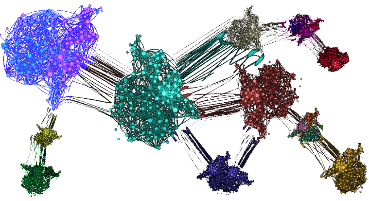

# Cluster-Morph

> This application allows you to cluster curves based on their morphology, you can upload the data to the server (SQLite3) and see a resume of the results on live and download a compacted file with all results.

### Built With

* Django
* SQLite3
* OAuth
* Biosppy
* SASS
* HTML
* JavaScript
* Python
* Bootstrap

> This application seeks to cluster curves (mostly time series) based on morphological characteristics of each curve, the code used is an adaptation of the code made in the initiation project "Computer Program for the Identification of Celestial Objects through the Analysis of Light Curves" made at the Federal University of Latin-American Integration (UNILA) in 2017

## 🚀 Tool
>If you want to use the code to cluster, the core algoritm is in the cluster.py file in 'scripts' folder. To use it the biosppy library is required.

## ☕ How it works
>
The identification of motifs (repeating patterns) is generally determined by a distance function (D) and the setting of an acceptance threshold (radius 'r'), a concept similar to the one used by this application. Thus, if radius is a positive real acceptance threshold, a time series with a sequence C1, and another sequence C2, let D be the distance between two objects, D(C1, C2)<=rD(C1, C2)<= r , then the C1 sequence is assumed to be similar to the C2 sequence. In this application, the Euclidean distance was used to group the requested sequences.

 >As data from different series can be compared, all curves and sequences analyzed are normalized to minimize problems arising from the use of units and different dispersions between variables. In order to know which sequences are repeated in the case of curves with different amounts of points, whether C1 is the largest curve and C2 the smallest, the Euclidean distance is taken from a sliding window comparing C1 and C2 generating an array (eucli), where the i-th position marks the distance of the sequence in C2 compared to the window in the i-th position of C1, where only the minimum eucli value will be considered to determine the similarity of C1 and C2.
>In grouping the selected sequences, so that each group represents a pattern, we seek to minimize the intra-group distances and maximize the extra-group distance. In order to know the quality of the cluster, we use the quality measure for clusters called Silhouette Coefficient, which is calculated as follows, the average of intra-group distances (a) and the distance between the sample and the closest group to which it does not belong (b). For each sample, the Silhouette Coefficient is given by (b-a)/max(a,b) with 1 being the best possible value for the quality and -1 the worst result.

(<a href="#readme-top">back to top</a>)

## 💻 Live on <a href='https://clustermorph.herokuapp.com/'>this free heroku app</a>

## Contact

Wallace Pannace - [Linkedin](https://www.linkedin.com/in/wallace-pannace-48ba72249/) - wallacepncp@gmail.com

(<a href="#readme-top">back to top</a>)

